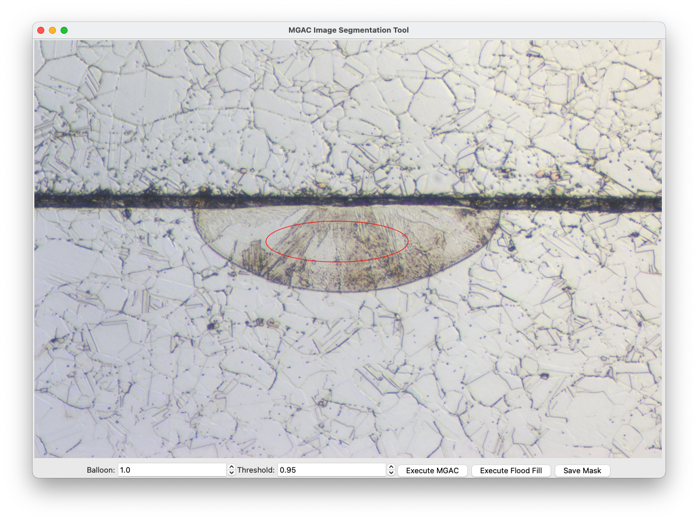

# lpbf-cs-image-analysis
Master repo for analysis of cross sectional images of LPBF melt tracks. 

## Getting Started

Install into a Python virtual environment, as you would any other Python project.

```sh
$ python3 -m venv venv
$ source venv/bin/activate
(venv) $ pip install git+ssh://git@github.com:nanoMFG/lpbf-cs-image-analysis.git
```

OR 

Install into a Conda virtual environment.
```sh
$ conda create --name my_env python=3.11
$ conda activate my_env
(my_env) $ pip install git+ssh://git@github.com:nanoMFG/lpbf-cs-image-analysis.git
```

Conversely, you can also clone the repo and run a `pip install`
```sh
$ git clone git@github.com:nanoMFG/lpbf-cs-image-analysis.git
$ cd lpbf-cs-image-analysis
$ pip install .
```

## mgac

Tool for image segmentation using active contours. 

Displays the image. A user can then click and drag to build an initialisation ellipse from the centre. Below the image are the balloon and threshold variables used for segmentation by the [Morphological Geodesic Active Contours function](https://scikit-image.org/docs/stable/api/skimage.segmentation.html#skimage.segmentation.morphological_geodesic_active_contour). Alternatively, the user can also choose to segment the image using simple edge detection and subsequent flood fill. 



### Usage

As a script, just run the module directly as below.
```sh
(venv) $ python3 -m mgac path/to/image.png
```
- Click and drag to create the initialisation ellipse.
- To generate a mask using edge detection and flood fill:
    - Click on the `Execute Flood Fill` button.
- To generate a mask using MGAC:
    - Select values for the balloon and threshold variables. 
    - Click on the `Execute MGAC` button.
    - Note: Semgentation by MGAC might take a little while. 
- Once the mask is generated, a new window with the segmented image will show up. 
- If you do not like the mask, close the new window, adjust the ellipse or the hyperparameters and redo the segmentation. 
- If you like the mask, close the new window and click the `Save Mask` button. 
- The mask will be saved with the same name as the given image, with the suffix `_mask`. 

Use inside your own Python projects. 

```python
>>> import mgac
>>> import matplotlib.pyplot as plt
>>> 
>>> centre_x = 700 # x coordinate of the centre of the ellipse
>>> centre_y = 450 # y coordinate of the centre of the ellipse
>>> s = np.linspace(0, 2*np.pi, 3200) # 3200 is the number of points
>>> r = centre_y + 50 * np.sin(s) # 50 is the size of the vertical axis
>>> c = centre_x + 150 * np.cos(s) # 150 is the size of the horizontal axis
>>> init = np.array([r, c]).T
>>>
>>> dilation_blur, ff_mask = edge_detection("example.png", centre_x, centre_y)
>>> output, evolution = mgas(img=dilation_blur, initialisation=init, balloon=1.0, threshold=0.95)
>>> 
>>> plt.imshow(output, cmap='gray')
```
- `ff_mask` is the flood fill mask (ndarray).
- `output` is the MGAC mask (ndarray).
- `evolution` is a list containing the progression of the contour. 

Refer to [playbook.ipynb](playbook.ipynb) for more information. 

## magicwand

Flood filling and paint filling masking tool.

Based on: https://github.com/alkasm/magicwand

Displays an image with a tolerance trackbar and a paint radius trackbar. A user can left-click anywhere on the image to seed a selection, where the range of allowable deviation from a color is given by the tolerance trackbar value. For custom painting, a user can right-click anywhere on the image to paint a circle, where the radius of the circle is given by the radius trackbar value. 


### Usage

As a script, just run the module directly as below.

```sh
(venv) $ python3 -m magicwand path/to/image.png
```
- Left-click to seed a selection.
- Drag to continue floodfill.
- Right-click to start painting circles.
- Drag to continue painting.
- Modifiers:
   - [SHIFT] subtracts from the selection.
   - [ALT] starts a new selection with a new seed.
   - [SHIFT] + [ALT] intersects the selections.
- Adjust sliders to change tolerance of floodfill and radius of painting.

You can always check the `--help` flag when running the module as a script for more info:

```sh
(venv) $ python3 -m magicwand --help
usage: magic wand mask generator [-h] [-s] [-fh] image

positional arguments:
  image               path to image

optional arguments:
  -h, --help          show this help message and exit
  -s , --save         toggle saving the mask (default = True)
  -fh , --fillholes   toggle filling holes in the mask (default = True)
```

Use inside your own Python projects:

```python
>>> from magicwand import SelectionWindow
>>> import cv2 as cv
>>> 
>>> img = cv.imread("example.jpg")
>>> window = SelectionWindow(img)
>>> window.show()
>>> 
>>> print(f"Selection mean: {window.mean[:, 0]}.")
Selection mean: [168.47536943 180.55278677 182.92791269].
```

The window object has a few properties you might be interested in after successfully filtering your image:

```python
>>> window.mean     # average value for each channel - from cv.meanStdDev(img, mask)
>>> window.stddev   # standard deviation for each channel - from cv.meanStdDev(img, mask)
>>> window.mask     # mask from cv.floodFill()
>>> window.img      # image input into the window
```
